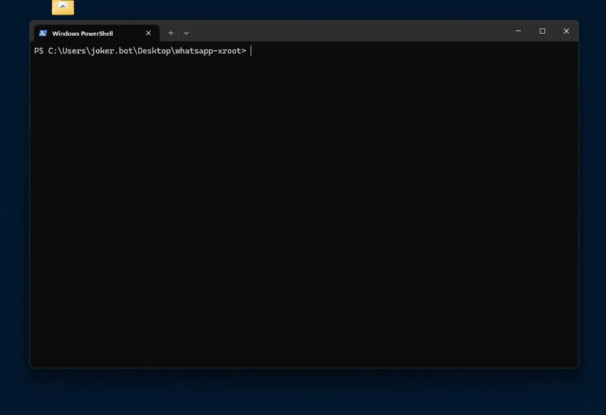
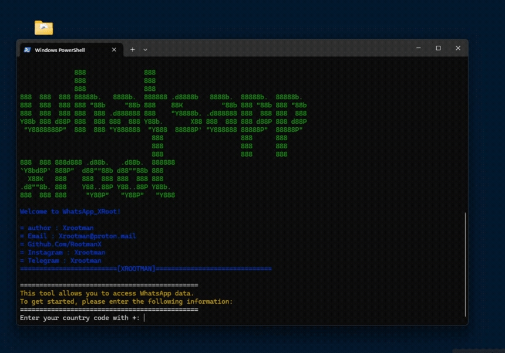

# About:

🔓 whatsapp_xroot - Breach WhatsApp with This Powerful Hacking Tool

Developed by the cybersecurity expert, #xrootman, the whatsapp_xroot tool exposes the shocking vulnerabilities within WhatsApp's web-based infrastructure, allowing you to infiltrate user accounts with ease.

________________________________________

# Features of the tool:

🔓 whatsapp_xroot - Breach WhatsApp with This Powerful Hacking Tool

Developed by the cybersecurity expert, #xrootman, the whatsapp_xroot tool exposes the shocking vulnerabilities within WhatsApp's web-based infrastructure, allowing you to infiltrate user accounts with ease.

🕵️‍♂️ Bypass WhatsApp's Security Protocols
Effortlessly bypass WhatsApp's security measures and gain unauthorized access to users' accounts through the web client.

🔍 Access WhatsApp's Complete Database
Once inside, you can extract the full WhatsApp database directly from the victim's mobile device, unveiling their chat history, contacts, and a wealth of personal information.

📥 Steal Messages, Photos, Videos & More
Exploit this vulnerability to download users' private media files, including messages, images, videos, and voice recordings, compromising their digital privacy.

🎯 Target Specific Victims
Selectively choose your targets and monitor their WhatsApp activity with surgical precision, making this a formidable tool in the wrong hands.

⚠️ For Educational Purposes Only
The purpose of whatsapp_xroot is to raise awareness about the urgent need for improved security measures in WhatsApp. The developer, #xrootman, does not condone the misuse of this tool for malicious intent.

#WhatsAppHack #DataBreach #PrivacyViolation #CyberSecurity

________________________________________

# WEB HACK:

# DATABASE HACK:

________________________________________

# How to Install

# termux / kali

pkg install python

pip install webbrowser

pip install colorama

pip install sys

pkg install git

git clone https://github.com/rootmanX/whatsapp-xroot.git

python xroot_VIP_ENC.py

# windows

install python 3 

run commands on terminal : 

pip install webbrowser

pip install colorama

pip install sys

Downloads : https://github.com/rootmanX/whatsapp-xroot/blob/main/whatsapp-xroot.exe

# CONTACT

👤 Contact [https://t.me/xrootman](https://t.me/xrootman) 🔗

# PRICE

💰 monthly : 99 USDT
💎 3 months : 199 USDT